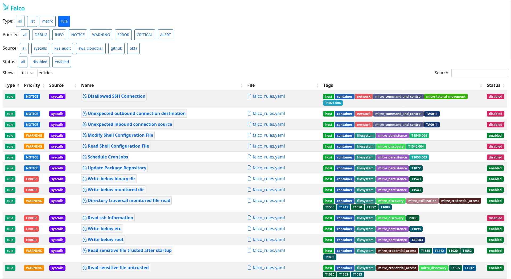

# Falco Rules Explorer



## Description

> This project is a WIP

Falco Rules Explorer is dashboard to explore the Falco rules in a friendly way. You can search, filter and display all details for rules.

The current indexed rules are:
- https://github.com/falcosecurity/rules/blob/main/rules/falco_rules.yaml
- https://github.com/falcosecurity/rules/blob/main/rules/application_rules.yaml
- https://github.com/falcosecurity/plugins/blob/master/plugins/k8saudit/rules/k8s_audit_rules.yaml
- https://github.com/falcosecurity/plugins/blob/master/plugins/cloudtrail/rules/aws_cloudtrail_rules.yaml
- https://github.com/falcosecurity/plugins/blob/master/plugins/github/rules/github.yaml
- https://github.com/falcosecurity/plugins/blob/master/plugins/okta/rules/okta_rules.yaml

## Index rules

```shell
go run .
```

It creates `index.json` which list all rules with their details.

## View the dashboard

```shell
python -m http.server 3000
```

Go to http://0.0.0.0:3000/.

## Frontend

The sources for the frontend are:
- `index.html`: the dashboard
- `rule.html`: show the details of a rule

## Author

Thomas Labarussias (https://github.com/Issif)
